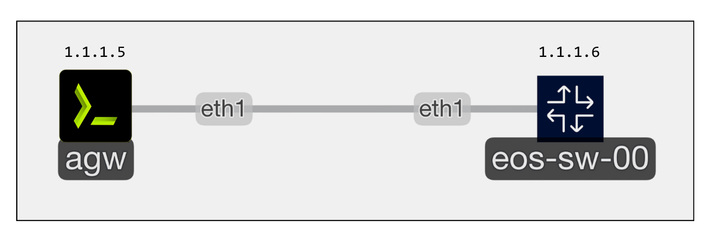

## Summary
This _project_ leverages the capibilities of [Containerlab](https://containerlab.dev) to build and run _container-based_ labs and uses [torero](https://torero.dev) as a _unified_ execution layer across your automation tools - [Ansible](https://docs.ansible.com/), [OpenTofu](https://opentofu.org/docs/), _Python_, and more. This project is meant to explore the _art of the possible_ as it pertains to scaling automation across _on-premises_ and _public-cloud_ infrastructure.

## 📒 Project Structure
This project contains the following components:
- [library](./library/) contains _ready-to-use_ automations separated by tool _(Ansible, OpenTofu, and Python)_.
- [labs](./labs) holds _purpose-built_ Containerlab topologies to run _automations_ against; each lab has a **1:1** relationship with an import file.
- [imports](./imports) are **.yml** files that _inventory_ a set of automations pertaining to a given lab; these are referenced in _Containerlab_ topology files and get imported to the lab at _runtime_.

## 🛠️ Dependencies
Finding examples of automation is great, but doesn't get you very far unless you have _purpose-built_ environments to run the automation against. To get the maximum value out of this project, you will need to setup the following:

- [Containerlab](https://containerlab.dev/install/) - an open-source tool for building ephemeral, container-based networking labs with multi-vendor topologies. Its ephemeral nature means that labs can be easily deployed, tested, and then destroyed, making it ideal for _short-term_ experimentation and continuous integration workflows.
- [Network OS Images](https://containerlab.dev/manual/kinds/) - network operating system images _(e.g., Cisco, Arista, Juniper, Nokia)_ required to run Containerlab topologies. You must obtain these images directly from the respective vendors, as they are not provided by Containerlab or Itential due to licensing restrictions. You will need to follow different steps for downloading and importing these images depending on the vendor.

## 🚀 Getting Started
Let's start out with running a basic lab to demonstrate backing up _configuration_ from an Arista device.

### Download + Import Arista cEOS
Follow the documentation [here](https://containerlab.dev/manual/kinds/ceos/) to download and install [Arista cEOS](https://www.arista.com/en/support/software-download). Arista requires you to create an account at https://arista.com prior to downloading any images.

### Clone Showtime Repository
Clone the _showtime_ repository to the machine where you have _Containerlab_ installed and change directories to the _arista-eos-config-backup_ lab:

```bash
git clone https://github.com/torerodev/showtime.git \
  && cd showtime/labs/ansible/arista-eos-config-backup \
  && ls -l
```


### 🔍 Understanding the Topology File
A _topology_ file in Containerlab is a **.yml-based** definition of your virtual network setup, including nodes _(e.g., routers, switches, or hosts)_, their properties, and the links between them. This allows you to describe complex scenarios in a declarative way. Each _topology_ will launch torero as an _automation gateway_ node, and import the _automations_ in scope for a given lab at runtime. To make this easy to track, [import file names](./imports/ansible/arista-eos-config-backup.yml) match [lab + topology file names](./labs/ansible/arista-eos-config-backup/arista-eos-config-backup.clab.yml) minus the required **.clab** suffix.

```yml
---
name: arista-eos-config-backup # Lab name matches imports/ansible/arista-eos-config-backup.yml

mgmt:
  network: agw-mgmt
  ipv4-subnet: 1.1.1.0/24

topology:
  nodes:

    # Arista cEOS node we can test our automations against
    eos-sw-00:
      kind: arista_ceos
      image: ceos:4.33.2F                 # Update with the name used when the image was imported
      startup-config: ./config/base.cfg   # Base config applied to device at startup
      mgmt-ipv4: 1.1.1.6                  # Management IP; Assigned based on inventory file

    # torero Automation Gateway node we can run our automations from
    agw:
      kind: linux
      image: torerodev/torero:latest      # Latest torero docker image
      mgmt-ipv4: 1.1.1.5
      env:
        ENABLE_SSH_ADMIN: "true"          # Enable simple ssh login with admin:admin 
      binds:
        - $PWD/data:/home/admin/data

      # Import automations that are in scope for this lab at runtime
      exec:
        - "runuser -u admin -- torero db import --repository https://github.com/torerodev/showtime.git imports/ansible/arista-eos-config-backup.yml"

  links:
    - endpoints: [ "eos-sw-00:eth1", "agw:eth1" ]
...
```

### Deploying the Topology
Use the following command to _deploy_ the topology:

```bash
clab deploy -t arista-eos-config-backup.clab.yml
```


> [!WARNING]
> Be sure to update the _image_ name in the topology file from _ceos:4.33.2F_ to the name chosen when the image was imported.

🔍 **The Layout**
Deploying the _topology_ will instantiate the latest version of _torero_ automation gateway with _eos-sw-00_ running **4.33.2F**.



### Running the Automation
Now that we have _deployed_ the topology, we can login to the _torero_ node and run the automation for the lab. The default login is _'admin:admin'_

```bash
ssh admin@1.1.1.5
```

